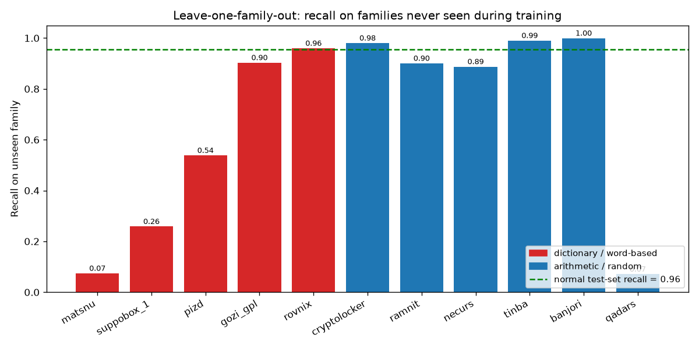
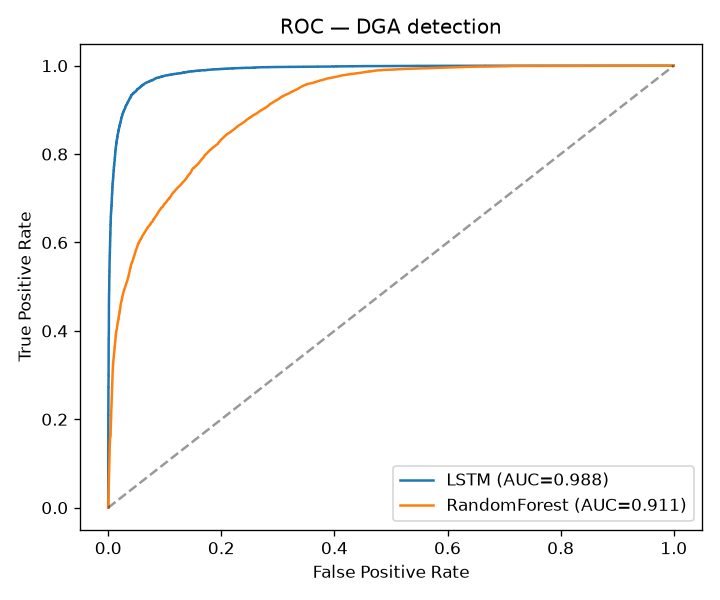
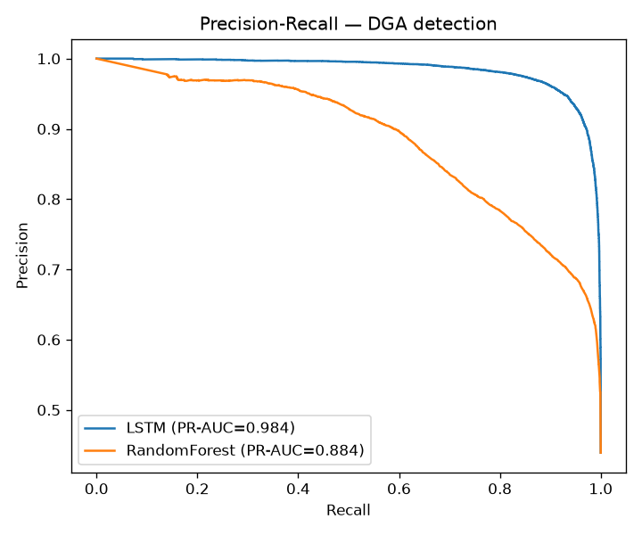

# DGA 惡意網域偵測:LSTM 泛化弱點與 LLM 二審分層架構

字元級 LSTM 偵測 DGA(演算法生成)網域,用 **leave-one-family-out** 揭露模型對
「訓練時沒見過的 DGA 家族」的泛化弱點,並與 Random Forest、LLM few-shot 三方比較。



> 上圖是本專案的核心結果:把每個 DGA 家族輪流當成「訓練時沒見過」的家族來測 LSTM 的
> Recall(紅=字典/組合型、藍=亂數型,綠色虛線為一般測試集 Recall)。亂數型即使沒見過仍有
> ~90–100%,但字典型(尤其 matsnu、suppobox_1)大幅崩落——這就是報告要凸顯的泛化盲區。

## 核心發現
- LSTM 在**已知家族**表現優異:測試集 F1 = **0.9403**、Recall = **0.9555**、PR-AUC = **0.984**。
- 但對 **leave-one-family-out(未見過家族)** 平均 Recall 降至 **0.6875**:
  其中**字典/組合型**家族平均僅 **0.5467**,**亂數型**家族平均 **0.8048**。
  → 印證報告主軸:*表面準確率很高,但對沒見過的家族(尤其字典型)會大幅崩落*。
- LLM few-shot(claude -p / fable)準確率 **0.95**,
  在**字典型未見過家族**上平均 Recall = **0.92**——
  因為具語言常識,在字典型 DGA 上反而優於 LSTM 的 LOO 表現。

## 三方比較

| 方法 | 準確率 | 未知家族Recall | 每千筆成本(USD) | 每筆延遲(ms) |
|---|---|---|---|---|
| 字元級LSTM | 0.9468 | 0.6875 | ~0 (本地) | 0.244 |
| RandomForest(手工特徵) | 0.814 | —(未做LOO) | ~0 (本地) | 0.01 |
| LLM few-shot (claude -p, fable) | 0.95 | 0.9636 | 6.0067 | 11205.0 |

> 註:LLM 樣本中所有家族對模型而言皆為「未見過」(few-shot 未含訓練)。延遲為逐筆
> `claude -p` 近似上界(含 CLI 啟動開銷)。成本取自 claude JSON 的 `total_cost_usd`。

### 判別力:ROC 與 PR 曲線(LSTM vs RandomForest)
<p align="center">
  
  
</p>

字元級 LSTM 的 ROC-AUC 與 PR-AUC 都明顯高於手工特徵的 RandomForest。由於正負樣本略不
平衡,**PR 曲線(右)比 ROC(左)更能反映實務偵測品質**。另附混淆矩陣 `results/confusion_lstm.png`。

## 建議架構
**LSTM 即時過濾 + LLM 對可疑樣本二審**:LSTM 快又準但對未見家族有洞;LLM 慢又貴,
但對字典型 DGA 靠語言常識補上 LSTM 的盲區。以 LSTM 做第一線高吞吐過濾,
對低信心/可疑樣本再交 LLM 二審,兼顧吞吐與泛化。

## 產出檔案(results/)
- `metrics_main.json` — LSTM 與 RF 在測試集的完整指標
- `roc_curve.png` / `pr_curve.png` / `confusion_lstm.png` — 曲線與混淆矩陣
- `misclass_false_positive.csv` / `misclass_false_negative.csv` — 誤判案例(人工分析用)
- `loo_results.json` / `loo_recall.png` — leave-one-family-out 泛化實驗
- `llm_metrics.json` / `llm_predictions.csv` — LLM 對照組
- `comparison_three_way.csv` — 三方比較表

## 資料來源、授權與倫理
- **資料不隨 repo 散布**:DGA 樣本來自 **UMUDGA**(Mendeley DOI `10.17632/y8ph45msv8.1`)、
  正常樣本來自 **Tranco Top-1M**(https://tranco-list.eu/)。下載方式、放置路徑與引用見 **[DATA.md](DATA.md)**。
- **程式碼授權**:MIT(見 [LICENSE](LICENSE));資料集各依其原始授權,不在本授權範圍。
- **倫理定位**:本專案為**防禦性**偵測研究,惡意網域清單源自公開學術資料集、未再散布,
  不提供任何 DGA 生成器或可攻擊產物。詳見 DATA.md。

## 重現方式
```bash
python -m venv venv && ./venv/bin/pip install -r requirements.txt
# 依 DATA.md 下載資料到 data/dga/*.txt 與 data/tranco.csv
./venv/bin/python src/preprocess.py --benign-n 120000 --family-cap 8000
./venv/bin/bash src/run_experiments.sh          # train(LSTM+RF) + leave-one-family-out
./venv/bin/python src/make_llm_sample.py
# LLM 對照組:--model 可換 haiku / sonnet / fable(本報告以 fable 為代表)
./venv/bin/python src/llm_baseline.py --input results/llm_sample.csv --model fable --outdir results/llm_fable
./venv/bin/python src/report.py --llm-metrics llm_fable/llm_metrics.json --llm-label fable
```

## 實作備註(資料處理與可重現性)

以下幾點在實作時容易出錯,且會直接影響實驗結論,一併記錄理由與處理方式。

**分層抽樣後必須保留家族標籤。** 在 pandas ≥ 2.x,`groupby("family").apply(...)` 搭配
`reset_index(drop=True)` 會把 `family` 併入 index 後一起丟掉,使標籤無聲消失、
leave-one-family-out 無從進行。本專案改用 `groupby("family", group_keys=False)[[...]]`
明確選取欄位,並在資料組完後以 `assert` 確認惡意樣本的 `family` 皆非空。

**只取主網域(SLD),但有一個例外。** DGA 的隨機性集中在 SLD,保留 TLD 會讓模型走捷徑
而使泛化評估失真,因此統一以 `tldextract` 取 SLD。少數家族(如 symmi)把隨機字串放在
子網域,只取 SLD 會塌成單一值,故予以排除;`preprocess.py` 內建 `sld.nunique()` 檢查,
避免日後新增家族時再度誤用。

**先合併正負樣本、去重,再切分。** 以 `drop_duplicates(subset="sld")` 在合併後去重,
確保同一個 SLD 不會同時落在訓練集與測試集,避免資料洩漏而高估效能。

**本輪以 CPU 規模執行,可放大重現。** 執行環境為 4 核 CPU;為兼顧時間,本輪採
benign ≈ 120k、每家族上限 8k(去重後約 200k,正負比 ≈ 1.28 : 1),leave-one-family-out
每折再降規模(benign 上限 40k、其他家族各 5k、4 epochs),並同時以 PR-AUC 評估。在 GPU
或更大機器上,可用 `--benign-n 300000 --family-cap 10000` 與更多 epochs 還原完整規模;
泛化缺口屬結構性,結論方向不受規模影響。
